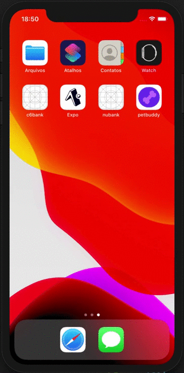

<h1 align="center">C6 BANK</h1>

 

  <a href="#rocket-technologies">Technologies</a>&nbsp;&nbsp;&nbsp;|&nbsp;&nbsp;&nbsp;
  <a href="#-project">Project</a>&nbsp;&nbsp;&nbsp;|&nbsp;&nbsp;&nbsp;
  <a href="#camera-images">Images</a>&nbsp;&nbsp;&nbsp;|&nbsp;&nbsp;&nbsp;
  <a href="#electric_plug-getting-started">Getting started</a>

 

  

## :rocket: Technologies

This project features all the latest tools and practices in mobile development!

- ⚛️ **React Native** — A lib that provides a way to create native apps for Android and iOS

## 💻 Project

This is a study project about animations with layout of C6 Bank :books:

## :camera: Images

<a href="https://github.com/joao-lucas-dev/c6bank-clone/tree/master/photos">Click here to see the images</a>

## :electric_plug: Getting started

1. Clone this repo using: `https://github.com/joao-lucas-dev/c6bank-clone.git`
2. Move yourself to the appropriate directory: `cd c6bank-clone`
3. To install all dependencies, run: `yarn`
4. If you use IOS, run: `cd ios` after `pod install`
5. Come back to directory: `c6bank-clone`.
6. Run `react-native run-ios` (or `run-android if your prefer) to start the mobile app

